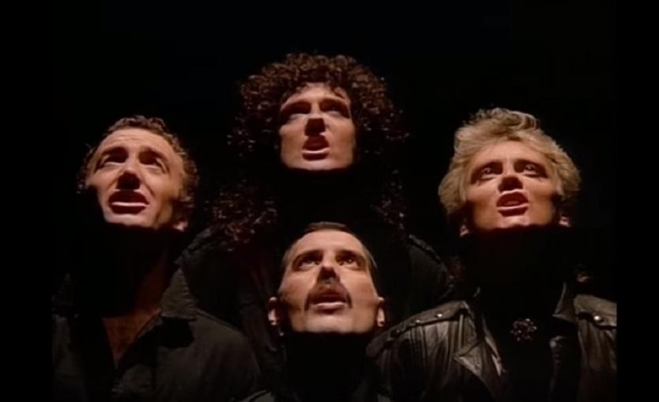
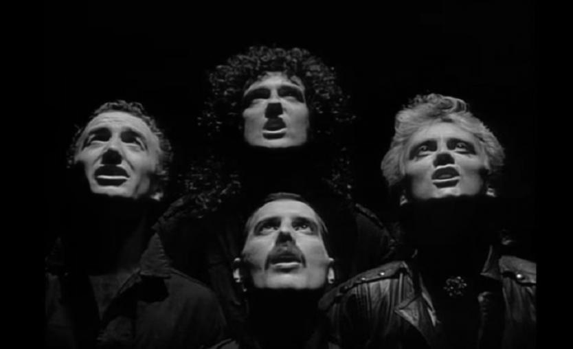
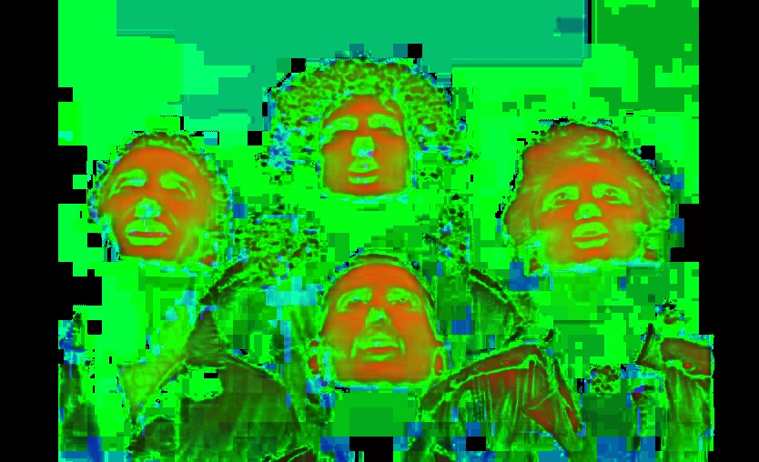
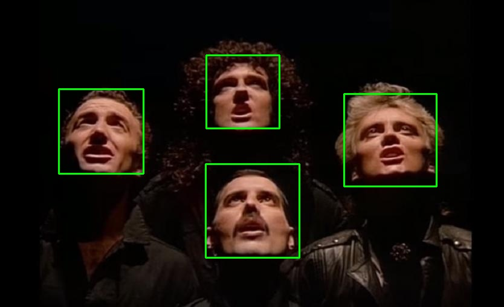
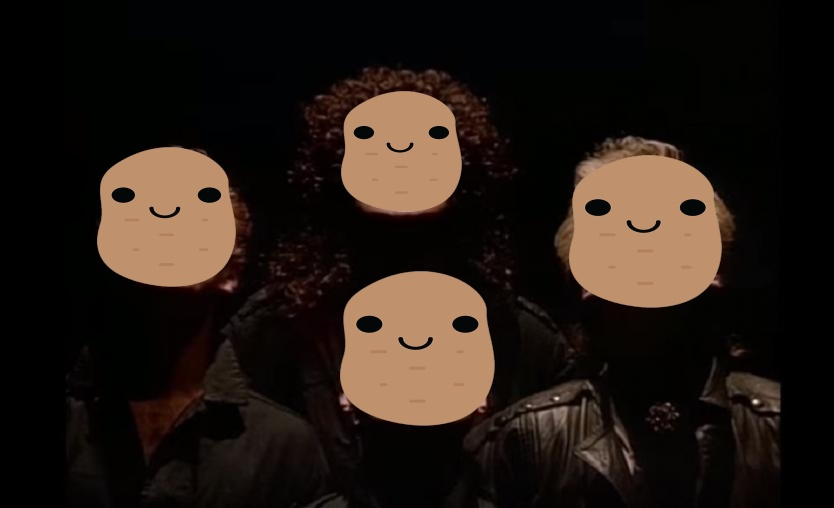

# Mr. Potato Head

## Objective

To learn how to use OpenCV with the Raspberry Pi! In this workshop, we will be writing a Python script to use OpenCV on the Raspberry Pi to replace faces with a potato!

## Setup

I've included a bash script called `setup.sh` to install all of the required dependencies. This script can be executed by typing `./setup.sh` in your terminal. You may have to run `chmod +x setup.sh` if its execution permission isn't set.

## What is OpenCV?

OpenCV is a library available for Python and C++ for computer vision based applications. In this workshop, we will be going over basic transformations and Haar feature-based cascading classifiers for facial recognition and detection.

## What is an Image?

Any image is simply a matrix consisting of values from 0 to 255 (if it's an 8-bit image) to represent brightness values. For example, the following would be a white 3 by 3 pixel image with a black pixel in the middle.

```
[
    [255 255 255]
    [255   0 255]
    [255 255 255]
]
```

However, the example above only applies to greyscale images. If we want a colour image, we would need something like the following:

```
[
    [ [0   100 255] [0   100 255] [0   100 255] ]
    [ [0   100 255] [255 218  13] [0   100 255] ]
    [ [0   100 255] [0   100 255] [0   100 255] ]
]
```

The example above is an orage 3 by 3 pixel image with a teal pixel in the middle. In order to represent a colour image, values for red, green, and blue need to be represented. Something to note about OpenCV is that image are represented in a BGR colourspace by default. Images can then be converted to an RGB or HSV colourspace if required.

<p align="center">
    
    <br>
    <i>Original Image</i>
</p>

<p align="center">
    
    <br>
    <i>Greyscale Image</i>
</p>

<p align="center">
    
    <br>
    <i>HSV Image</i>
</p>

## Reading an Image

```
import cv2
import numpy as np

img = cv2.imread('image.jpg')
cv2.imshow('potato', img)

cv2.waitKey(0)
cv2.destroyAllWindows()
```

## Basic Image operations

### Converting to Greyscale
```
grey = cv2.cvtColor(img, cv2.COLOR_BGR2GRAY)
```

### Resizing Images
```
dimensions = (300, 300)
resized_img = cv2.resize(img, dimensions)
```

## Haar Feature-Based Cascade Classifiers (Viola-Jone Face Detection Algorithm)

[Good YouTube video explaining the Viola-Jones algorithm](https://www.youtube.com/watch?v=uEJ71VlUmMQ)

[Resource from OpenCV docs](https://docs.opencv.org/3.4.3/d7/d8b/tutorial_py_face_detection.html)

Using a Haar feature-based classifier isn't necessarily the best approach for face detection. There are many alternatives including deep learning, which will not be covered today. We decided to use this approach due to its ease of use, fairly high efficiency, and because it is more than adequate for our objective today.

<p align="center">
    
    <br>
    <i>Haar Features</i>
</p>

<p align="center">
    
    <br>
    <i></i>
</p>

## Using a Haar Classifier in OpenCV

```
face_cascade = cv2.CascadeClassifier('haarcascade_frontalface_default.xml')
faces = face_cascade.detectMultiScale(grey, scaleFactor=1.1, minNeighbors=4)

for (x,y,w,h) in faces:
    cv2.rectangle(img, (x, y), (x+w, y+h), (0, 255, 0), 2)
```


## Putting Everything Together

Import required libraries
```
import cv2
import numpy as np
import sys
```

Define a helper function for resizing images
```
def resize_image(img, height):
    ratio = float(height) / img.shape[0]
    dim = (int(img.shape[1]*ratio), height)

    image = cv2.resize(img, dim, interpolation=cv2.INTER_AREA)
    return image
```

Read initial images and apply preprocessing
```
if __name__ == '__main__':
    img = cv2.imread(sys.argv[1])
    grey = cv2.cvtColor(img, cv2.COLOR_BGR2GRAY)

    potato = cv2.imread('images/potato-square-wide.png', cv2.IMREAD_UNCHANGED)
```

<p align="center">
    
    <br>
    <i>Input Image</i>
</p>

Create cascade classifier and search for faces
```
    face_cascade = cv2.CascadeClassifier('haarcascade_frontalface_default.xml')
    faces = face_cascade.detectMultiScale(grey, scaleFactor=1.1, minNeighbors=4)

    print("{} faces found!".format(len(faces)))
```

<p align="center">
    
    <br>
    <i>Found faces with bounding boxes applied</i>
</p>


Iterate over found faces and overlay a resized potato
```
    for (x,y,w,h) in faces:
        smallpotato = resize_image(potato, h)

        alpha_potato = smallpotato[:, :, 3] / 255.0
        alpha_img = 1.0 - alpha_potato

        y1, y2 = y, y + smallpotato.shape[0]
        x1, x2 = x, x + smallpotato.shape[1]

        for c in range(0, 3):
            img[y1:y2, x1:x2, c] = (alpha_potato * smallpotato[:, :, c] + alpha_img * img[y1:y2, x1:x2, c])
```

Display final image and wait for user input
```
    cv2.imshow('potato', img)
    cv2.waitKey(0)
    cv2.destroyAllWindows()
```

<p align="center">
    
    <br>
    <i></i>
</p>


<p align="center">
    
    <br>
    <i></i>
</p>